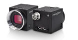
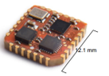
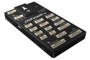
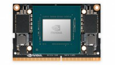

# Bill of Materials (BOM)

## Jetson CV Hub - Component List

### Core Components

| Item | Description | Quantity | Manufacturer/Part Number | Notes |
|------|-------------|----------|--------------------------|-------|
| 1 | NVIDIA Jetson Orin (NX/Nano/AGX) | 1 | NVIDIA | Specify model based on requirements |
| 2 | FLIR Machine Vision Camera | 2-4 | FLIR/Teledyne | Model: [Specify model] |
| 3 | Xsense IMU | 1 | Xsense | MTi Series (6-DOF or 9-DOF) |
| 4 | PX4 Flight Controller | 1 | [Compatible PX4 board] | For hardware synchronization and redundant IMU |
| 5 | Power Supply Unit | 1 | [TBD] | Input: 100-240V AC, Output: [TBD]V DC |
| 6 | Power Distribution Board | 1 | Custom/COTS | Provides power to all components |

#### Core Component Images

*FLIR Blackfly U3-23S6 Machine Vision Camera*

*Xsense MTi Inertial Measurement Unit*

*PX4 flight controller for hardware synchronization*

*NVIDIA Jetson Orin module*

### Camera Lenses

Available lens options for FLIR cameras:

| Item | Description | Price (Approx.) | Vendor | Part Number | Notes |
|------|-------------|----------------|---------|-------------|-------|
| 7 | 185° Fisheye Lens | ₹650,000 / ~$7,800 | Cylod | FE185C086HA-1 | Ultra-wide field of view |
| 8 | 120° Wide Angle Lens | ₹590,000 / ~$7,100 | Edmund Optics | TechSpec-c 3.5 | Wide field of view |
| 9 | Standard Lens | ₹189,968 / ~$2,300 | Kowa | LM4NCL | Standard FOV |
| 10 | Telephoto Lens | ₹824,571 / ~$9,900 | Kowa | LM3NCM | Narrow FOV, long distance |

### Mounting Hardware

| Item | Description | Quantity | Part Number | Notes |
|------|-------------|----------|-------------|-------|
| 11 | M3 x 8mm Socket Head Cap Screws | 20 | ISO 4762 | For general assembly |
| 12 | M3 x 12mm Socket Head Cap Screws | 10 | ISO 4762 | For thicker mounting points |
| 13 | M3 Hex Nuts | 30 | ISO 4032 | Standard hex nuts |
| 14 | M3 Washers | 30 | ISO 7089 | Flat washers |
| 15 | M2.5 x 6mm Screws | 16 | ISO 7045 | For camera mounting |
| 16 | M3 Threaded Brass Inserts | 20-30 | M3x5.7mm | For 3D printed parts, [Amazon Link](https://www.amazon.com/initeq-M3-0-5-Threaded-Inserts-Printing/dp/B077CL322T) |
| 17 | Standoffs Set | 1 set | Various sizes | [Amazon Link](https://www.amazon.com/Pastall-Raspberry-Installation-Standoff-Accessories/dp/B08MF8LDBS) |

### Connectors & Cables

| Item | Description | Quantity | Part Number | Supplier | Notes |
|------|-------------|----------|-------------|----------|-------|
| 18 | USB 3.0 Cable | 2-4 | Various | Amazon/Mouser | For camera connections |
| 19 | Ethernet Cable | 1 | CAT6 | Amazon/Mouser | For network connectivity |
| 20 | Power Cable (IEC C13/C14) | 1 | [TBD] | Amazon/Mouser | Mains power input |
| 21 | GPIO Connector | 1 | [TBD] | Amazon/Mouser | For IMU interface |
| 22 | Connectors Set | 2 | Various | Amazon | [Link](https://www.amazon.com/dp/B07DJ63MJP) |
| 23 | XT90 Battery Connector | 1 | XT90 | Amazon | [Link](https://www.amazon.com/Yasoca-Battery-Connector-Bullet-Connectors/dp/B08P1PDF7C) |
| 24 | Wago Lever Nuts | 1 set | WAGO 221 | Amazon | [Link](https://www.amazon.com/Lever-Nuts-Compact-Splicing-Connector-Contains/dp/B091ZKXC14) |

### 3D Printed Parts

| Item | Description | Quantity | CAD File | Material |
|------|-------------|----------|----------|----------|
| 25 | Base Plate (Standard) | 1 | `base_jetplate.stl` | PETG |
| 26 | Base Plate (Battery Version) | 1 | `base_jetplate_bat.stl` | PETG |
| 27 | Handle | 1 | `Handle.stl` | PETG/PLA |
| 28 | T265 Mount (Primary) | 1 | `t265_mount_imm.stl` | PLA |
| 29 | T265 Mount (Secondary) | 1 | `t265_mount_imm_secondary.stl` | PLA |
| 30 | T265 Cover | 1 | `t265cover1.stl` | PLA |
| 31 | Jetson Display Mount | 1 | `jet_display_mount.stl` | PLA |
| 32 | Display Mount Cover | 1 | `jet_display_mount_cover.stl` | PLA |
| 33 | VICON Holder | 1 | `VICON_HOLDER.stl` | PLA |

**Note**: See `cad/3d_prints/` directory for all STL files.

### Electronics & Power Components

| Item | Description | Quantity | Supplier | Notes |
|------|-------------|----------|----------|-------|
| 34 | Voltage Regulator | 2 | Amazon | [Link](https://www.amazon.com/dp/B085T73CSD) |
| 35 | Buck-Boost Converter | 2 | Amazon | DC 5.5-30V adjustable, [Link](https://www.amazon.com/DROK-5-5-30V-Adjustable-Regulator-Converter/dp/B07VNDGFT6) |
| 36 | LiPo Voltage Monitor | 1 | Amazon | Battery monitor, [Link](https://www.amazon.com/CAMWAY-Battery-Voltage-Monitor-Checker/dp/B07DC3LH9C) |
| 37 | Cooling Fan | 1-2 | Various | 40mm x 10mm, 5V/12V |
| 38 | Thermal Pads | As needed | Various | For heat dissipation |

### Miscellaneous Components

| Item | Description | Quantity | Supplier | Notes |
|------|-------------|----------|----------|-------|
| 39 | Velcro Straps | 5 | Amazon | For cable management |
| 40 | Anti-slip Pads | 4 | Amazon | For base stability |
| 41 | Acrylic Board | 2 | Local supplier | For protective covers |
| 42 | Double-Sided Tape | 1 roll | Amazon/Hardware Store | 3M VHB or equivalent |

### Optional Components

| Item | Description | Quantity | Part Number | Notes |
|------|-------------|----------|-------------|-------|
| 43 | microSD Card | 1 | SanDisk/Samsung | 64GB+ for Jetson storage |
| 44 | SSD (NVMe) | 1 | Samsung/WD | Optional expanded storage, recommended for performance |
| 45 | WiFi/Bluetooth Module | 1 | Intel/Realtek | If not integrated in Jetson |
| 46 | LED Indicators | 3-5 | Various | Status/power indicators |

## Notes

- Quantities are for a single unit configuration
- Part numbers marked as [TBD] should be specified based on specific project requirements
- Camera quantity (1-4) depends on the specific application needs
- All fasteners are metric; imperial equivalents may be substituted where appropriate
- Refer to assembly instructions for specific component placement

## Total Estimated Cost

- Core Components: $[TBD]
- Hardware & Cables: $[TBD]
- 3D Printing Materials: $[TBD]
- **Total**: $[TBD]

## Suppliers

### International Suppliers

- **Electronics & Components**: 
  - [Digi-Key](https://www.digikey.com/) - Worldwide shipping
  - [Mouser Electronics](https://www.mouser.com/) - Worldwide shipping
  - [Arrow Electronics](https://www.arrow.com/) - Global distributor
  
- **Fasteners & Hardware**: 
  - [McMaster-Carr](https://www.mcmaster.com/) - US, ships internationally
  - [Amazon](https://www.amazon.com/) - Available in most countries
  
- **Cameras**: 
  - [FLIR/Teledyne Direct](https://www.flir.com/) - Authorized distributors worldwide
  - [Edmund Optics](https://www.edmundoptics.com/) - Global optical components
  
- **Jetson**: 
  - [NVIDIA Partners](https://www.nvidia.com/en-us/autonomous-machines/embedded-systems/where-to-buy/) - Authorized resellers
  - [SparkFun](https://www.sparkfun.com/)
  - [Adafruit](https://www.adafruit.com/)
  - [Seeed Studio](https://www.seeedstudio.com/)

- **3D Printing Materials**:
  - Local 3D printing services
  - [Prusa Filament](https://www.prusa3d.com/)
  - [MatterHackers](https://www.matterhackers.com/)

### Note on Links

The Amazon links provided in this BOM may be region-specific or become outdated. Please:
- Search for equivalent products in your region
- Verify specifications match requirements
- Check for updated versions or replacements
- Consider local alternatives to reduce shipping costs

## Revision History

| Version | Date | Author | Changes |
|---------|------|--------|---------|
| 1.0 | [Date] | [Author] | Initial BOM release |

