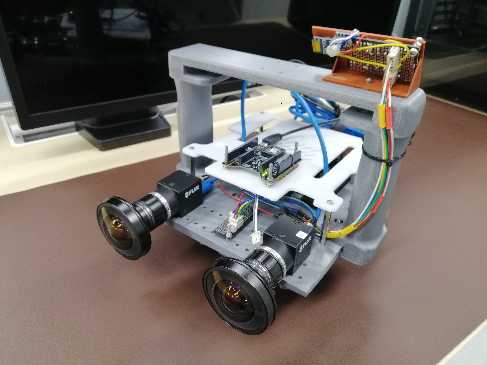

# Quick Start Guide

## Jetson CV Hub - Get Started in 5 Steps

This guide provides a fast-track overview to get your Jetson CV Hub up and running.

🎥 **[Watch the Project Video](https://youtu.be/AM4CTzeO3oE)** for an overview of features and results!



### Prerequisites

- [ ] All components from [BOM.md](BOM.md) acquired
- [ ] 3D printer available (or access to one)
- [ ] Basic electronics and soldering skills
- [ ] Computer with internet access
- [ ] 2-3 days for assembly and setup

---

## Step 1: Print the Parts (1-2 days)

1. Download CAD files from `cad/` directory
2. Slice files for your 3D printer
3. Print using recommended settings:
   - Material: PETG or PLA
   - Layer height: 0.2mm
   - Infill: 20-30%
4. Clean and prepare printed parts

**Time**: 1-2 days depending on printer speed

---

## Step 2: Assemble Hardware (2-4 hours)

1. Follow [Assembly Instructions](docs/ASSEMBLY_INSTRUCTIONS.md)
2. Key steps:
   - Mount Jetson Orin
   - Install cameras
   - Mount IMU
   - Connect all cables
   - Close housing
3. Perform pre-power checks

**Time**: 2-4 hours for first build

---

## Step 3: Initial Software Setup (1-2 hours)

1. Flash JetPack to Jetson storage
2. Boot and configure system
3. Update all packages
4. Install basic development tools

**Quick Commands**:
```bash
sudo apt update && sudo apt upgrade -y
sudo apt install -y build-essential cmake git python3-pip
```

**Time**: 1-2 hours including downloads

---

## Step 4: Install Drivers (30-60 minutes)

1. **FLIR Spinnaker SDK**:
   ```bash
   # Download from FLIR website
   tar -xzf spinnaker-*-arm64-pkg.tar.gz
   cd spinnaker-*-arm64
   sudo sh install_spinnaker_arm.sh
   ```

2. **Xsense IMU Software**:
   ```bash
   # Follow Xsense installation guide
   # Set up udev rules for USB access
   ```

3. **Test hardware**:
   ```bash
   # Test cameras
   spinview
   
   # Test IMU
   mtmanager
   ```

**Time**: 30-60 minutes

---

## Step 5: Calibrate System (1-2 hours)

1. **Camera calibration**:
   - Print checkerboard pattern
   - Capture calibration images
   - Run calibration software
   - Save results to `calibration/camera/`

2. **IMU calibration**:
   - Place on level surface
   - Run calibration procedure
   - Save results to `calibration/imu/`

3. **Camera-IMU calibration**:
   - Use Kalibr or similar tool
   - Save transformation matrices

**Time**: 1-2 hours for basic calibration

---

## You're Ready!

Your Jetson CV Hub is now operational. Next steps:

### Verify Everything Works

```bash
# Check system status
htop
sudo tegrastats

# Test camera capture
python3 -c "import cv2; cap = cv2.VideoCapture(0); ret, _ = cap.read(); print('OK' if ret else 'FAIL')"

# Test IMU (if using ROS)
ros2 topic list
```

### Start Your Project

- See [Setup Instructions](docs/SETUP_INSTRUCTIONS.md) for advanced configuration
- Review [Calibration README](calibration/README.md) for detailed procedures
- Check examples directory (when available) for sample code

### Common First Projects

1. **Real-time Camera Stream**:
   - Display camera feed on screen
   - Apply basic image processing
   - Measure FPS

2. **IMU Data Logger**:
   - Record IMU measurements
   - Visualize orientation
   - Analyze sensor data

3. **Visual-Inertial Fusion**:
   - Combine camera and IMU
   - Estimate pose/motion
   - Run SLAM algorithms

---

## Troubleshooting

### Camera Not Detected
```bash
lsusb  # Check USB devices
# Try different USB port (use USB 3.0)
# Check cable connections
```

### Jetson Won't Boot
- Check power supply (need adequate amperage)
- Verify SD card properly flashed
- Try re-flashing with Balena Etcher

### IMU Not Responding
```bash
lsusb | grep -i xsens
# Check udev rules
# Verify USB cable
```

### More Help?
- Open an issue on GitHub
- Check [Troubleshooting sections](docs/SETUP_INSTRUCTIONS.md#troubleshooting)
- Review manufacturer documentation

---

## Time Estimate Summary

| Task | Time |
|------|------|
| 3D Printing | 1-2 days |
| Hardware Assembly | 2-4 hours |
| Software Setup | 1-2 hours |
| Driver Installation | 30-60 min |
| Calibration | 1-2 hours |
| **Total Active Time** | **~6-10 hours** |
| **Total Calendar Time** | **2-3 days** |

---

## Tips for Success

- **Read first, build later**: Review all documentation before starting
- **Test incrementally**: Check each component as you install it
- **Document your build**: Take photos and notes for troubleshooting
- **Join the community**: Share your experience and help others
- **Start simple**: Get basic functionality working before advanced features

---

## Need More Detail?

This is just the quick start. For comprehensive information:

- 📖 [Full Assembly Instructions](docs/ASSEMBLY_INSTRUCTIONS.md)
- 💻 [Complete Setup Guide](docs/SETUP_INSTRUCTIONS.md)
- 🎯 [Calibration Procedures](calibration/README.md)
- 📦 [Bill of Materials](BOM.md)
- ❓ [Contributing & Support](CONTRIBUTING.md)

---

**Happy Building! 🚀**

If you build a Jetson CV Hub, we'd love to see it! Share your project on GitHub Discussions or social media with #JetsonCVHub
