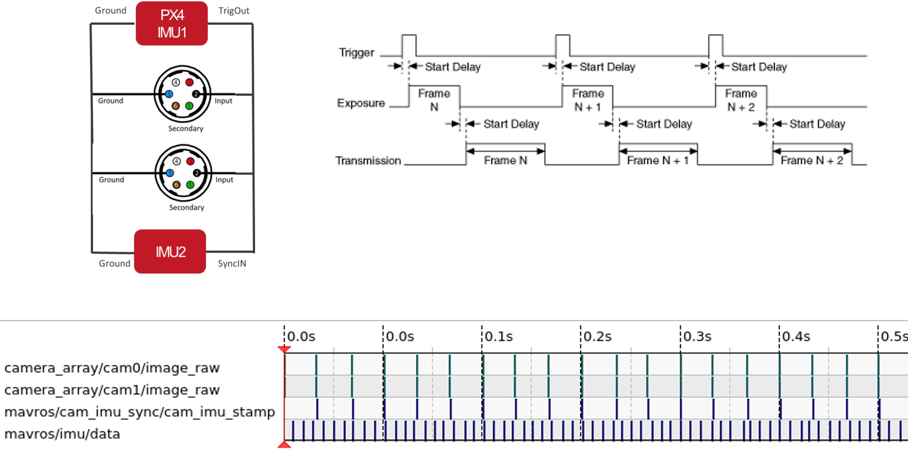

# Jetson CV Hub

An Open Source 3D Printable Computer Vision Hub for Researchers

📖 **[Visit the Project Website](https://sasakuruppuarachchi.github.io/jetson-cv-hub/)** for a better reading experience!

🎥 **[Watch the Project Video](https://youtu.be/AM4CTzeO3oE)** - Overview, features, and results demonstration!

## Overview

The Jetson CV Hub is a versatile, reconfigurable computer vision platform designed for robotics and machine vision research. It integrates:

- **FLIR Machine Vision Cameras**: High-quality imaging for computer vision applications with hardware synchronization
- **Xsense IMU**: Precision inertial measurement for motion tracking and sensor fusion
- **PX4 Flight Controller**: Master timing source for hardware synchronization (100 Hz trigger), provides redundant IMU, enables easy low-level control and direct deployability to drones
- **NVIDIA Jetson Orin**: Powerful onboard computing with GPU acceleration
- **Onboard Power**: Integrated power management for all components
- **Modular Design**: 3D printable housing with reconfigurable mounting options

### Hardware Synchronization

The system features precise hardware synchronization with PX4 as the master device producing trigger signals at 100 Hz. The cameras and Xsense IMU are connected in parallel to receive synchronized timing signals, ensuring accurate temporal alignment for visual-inertial applications.


*Hardware synchronization architecture with PX4-based trigger system*


*Front view showing FLIR cameras and sensor array*


*Back view showing Jetson Orin, power distribution, and connectors*


*Annotated diagram of all major components*


## Features

- ✅ **Open Source**: All CAD files, documentation, and assembly instructions freely available
- ✅ **3D Printable**: Design optimized for standard FDM 3D printers
- ✅ **Modular**: Support for 1-4 cameras with flexible mounting configurations
- ✅ **Reconfigurable**: Adapt the system for different applications and sensors
- ✅ **Well-Documented**: Comprehensive assembly, setup, and calibration guides
- ✅ **Research-Ready**: Calibration files and integration examples included

## Repository Structure

```
jetson-cv-hub/
├── cad/                    # 3D printable CAD files
│   └── README.md          # CAD file documentation and printing guidelines
├── calibration/           # Sensor calibration files and procedures
│   └── README.md          # Calibration guide
├── docs/                  # Documentation
│   ├── ASSEMBLY_INSTRUCTIONS.md    # Hardware assembly guide
│   └── SETUP_INSTRUCTIONS.md       # Software setup and configuration
├── docs-site/             # GitHub Pages website source
│   ├── index.html         # Landing page
│   ├── assembly.html      # Assembly instructions page
│   ├── setup.html         # Setup instructions page
│   └── css/               # Website styling
├── figures/               # Images and diagrams for documentation
├── BOM.md                 # Bill of Materials
├── README.md              # This file
└── LICENSE                # Apache 2.0 License
```

## Getting Started

### Quick Start

⚡ **Want to get started quickly?** Check out the [Quick Start Guide](QUICK_START.md) for a streamlined setup process.

### Detailed Setup Process

### 1. Review the Bill of Materials

Start by reviewing the [Bill of Materials (BOM)](BOM.md) to understand required components and parts.

### 2. Print the Parts

Follow the instructions in [cad/README.md](cad/README.md) to:
- Download and prepare CAD files
- Configure your 3D printer
- Print all required components

### 3. Assemble the Hardware

Follow the step-by-step [Assembly Instructions](docs/ASSEMBLY_INSTRUCTIONS.md) to:
- Prepare components
- Mount electronics
- Install cameras and sensors
- Complete cable management
- Perform quality checks

### 4. Configure the Software

Use the [Setup Instructions](docs/SETUP_INSTRUCTIONS.md) to:
- Install JetPack on Jetson Orin
- Configure FLIR camera drivers
- Set up Xsense IMU interface
- Install development tools
- Configure network and remote access

### 5. Calibrate the System

Follow procedures in [calibration/README.md](calibration/README.md) to:
- Calibrate camera intrinsics
- Perform IMU calibration
- Complete camera-IMU extrinsic calibration
- Validate calibration results

## Hardware Specifications

### Core Components

| Component | Description |
|-----------|-------------|
| **Compute** | NVIDIA Jetson Orin (NX/Nano/AGX) |
| **Cameras** | FLIR Machine Vision (1-4 units, model configurable) |
| **IMU** | Xsense MTi Series (6-DOF or 9-DOF) |
| **Power** | Integrated power distribution system |
| **Housing** | 3D printed PETG/PLA enclosure |

### Connectivity

- USB 3.0 for camera interfaces
- GPIO/USB for IMU connection
- Gigabit Ethernet
- WiFi/Bluetooth (optional)
- External I/O ports for expansion

## Use Cases

The Jetson CV Hub is designed for various research applications:

- 🤖 **Mobile Robotics**: Visual-inertial odometry and SLAM
- 🏭 **Industrial Automation**: Quality inspection and object detection
- 🚁 **Drone/UAV Systems**: Autonomous navigation and mapping
- 🔬 **Research Projects**: Computer vision algorithm development
- 📊 **3D Reconstruction**: Multi-camera stereo and structure-from-motion
- 🎯 **Object Tracking**: Real-time visual tracking with IMU fusion

## Software Stack

The system natively runs **ROS2 Humble** on NVIDIA Jetson with full GPU acceleration support.

Compatible with:
- **ROS2 Humble**: Native Robot Operating System 2 support with real-time capabilities
- **JetPack SDK**: NVIDIA's comprehensive development environment
- **Isaac ROS**: NVIDIA's GPU-accelerated ROS2 packages
- **NVIDIA Docker**: Containerized development environment
- **OpenCV**: Computer vision library with CUDA acceleration
- **CUDA**: GPU-accelerated computing
- **PyTorch/TensorFlow**: Deep learning frameworks
- **Spinnaker SDK**: FLIR camera control
- **MT Software Suite**: Xsense IMU interface
- **PX4 Autopilot**: Flight control and hardware synchronization

## Community and Support

### Contributing

We welcome contributions! Please feel free to:
- Submit issues for bugs or feature requests
- Contribute improvements to documentation
- Share your modifications and use cases
- Submit pull requests for enhancements

### Getting Help

- **Issues**: Open an issue on GitHub for bugs or questions
- **Discussions**: Use GitHub Discussions for general questions
- **Documentation**: Check the docs folder for detailed guides

## License

This project is licensed under the Apache License 2.0 - see the [LICENSE](LICENSE) file for details.

## Citation

If you use this project in your research, please cite:

```bibtex
@misc{jetson-cv-hub,
  title={A Synchronized Visual-Inertial Sensor System on Jetson for Accurate Real-Time SLAM},
  author={[Author Name]},
  year={2024},
  publisher={GitHub},
  url={https://github.com/SasaKuruppuarachchi/jetson-cv-hub}
}
```

**Note**: "Jetson CV Hub" is the short name of the project. The formal publication name is "A Synchronized Visual-Inertial Sensor System on Jetson for Accurate Real-Time SLAM".

## Acknowledgments

This project builds upon:
- NVIDIA Jetson ecosystem
- FLIR/Teledyne machine vision technology
- Xsense inertial measurement systems
- Open source computer vision community

## Roadmap

Future enhancements planned:
- [ ] Additional camera mount designs
- [ ] Example applications and tutorials
- [ ] ROS2 integration packages
- [ ] Pre-configured software images
- [ ] Thermal management improvements
- [ ] Alternative power supply options

## Status

**Current Status**: Initial Release (Draft)

This is the initial release with draft documentation. All files are subject to refinement and improvement based on community feedback and testing.

---

**Built with ❤️ for the computer vision research community**
