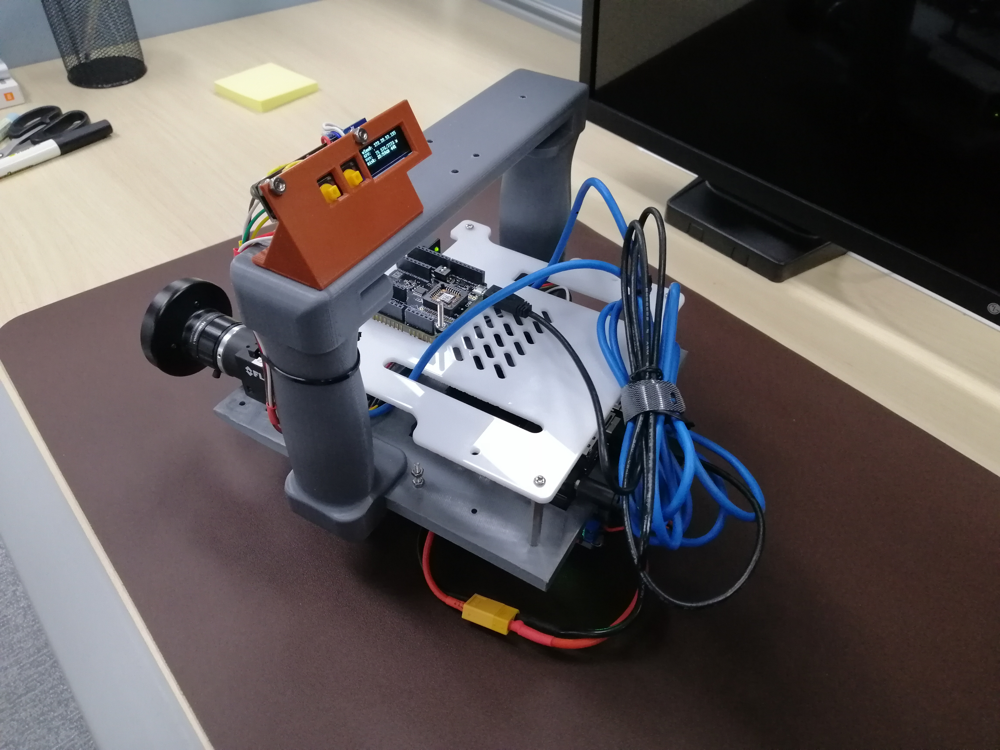
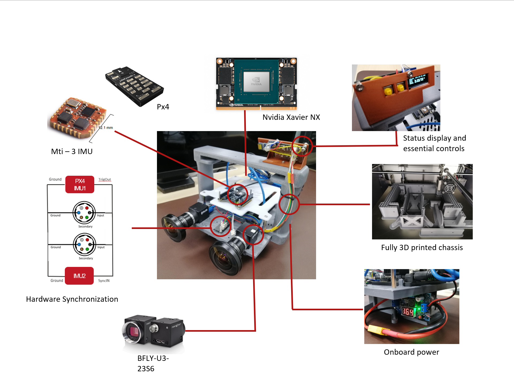
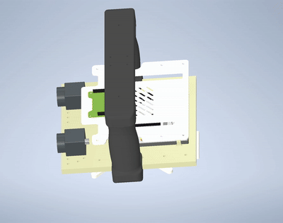

# Figures Directory

This directory contains images and figures used in the Jetson CV Hub documentation.

## Available Figures

### Device Images

- **`device_front.jpg`** (3.5 MB) - Front view of the assembled Jetson CV Hub showing cameras and sensors
- **`device_back.jpg`** (3.5 MB) - Back view showing Jetson, connectors, and power components
- **`device_isometric.gif`** (1.5 MB) - Animated isometric view of the device
- **`device_parts_named.png`** (1.5 MB) - Annotated diagram showing all major components

### Hardware Synchronization

Hardware synchronization diagrams showing the PX4-based trigger system will be added here. The system uses:
- PX4 as master device generating 100 Hz trigger signal
- Cameras and Xsense IMU connected in parallel to receive sync signals
- Precise temporal alignment for visual-inertial SLAM

## Usage

Images in this directory can be referenced in markdown documentation files:

```markdown




```

## Organization

Organize images by category:

```
figures/
├── assembly/           # Assembly photos and diagrams
├── hardware/          # Hardware component photos
├── setup/             # Setup screenshots
├── diagrams/          # System diagrams and schematics
└── results/           # Example output and results
```

## Image Guidelines

- Use descriptive filenames (e.g., `jetson-orin-mounting.jpg` instead of `img001.jpg`)
- Optimize images for web (recommended max width: 1200px)
- Use PNG for diagrams and screenshots
- Use JPEG for photos
- Include alternative text in markdown for accessibility

## GitHub Pages

All images in this directory are automatically copied to the GitHub Pages site and can be displayed in the documentation pages.

## Examples

To add an assembly photo:
1. Place the image in `figures/assembly/`
2. Reference it in `docs/ASSEMBLY_INSTRUCTIONS.md`:
   ```markdown
   
   ```

The image will then appear both in the GitHub repository view and on the GitHub Pages site.
